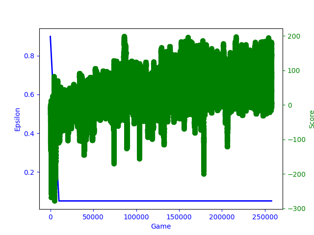
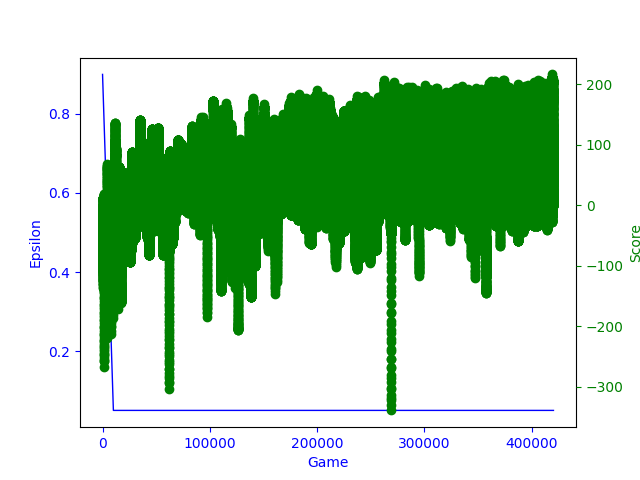

# Лабораторная работа. Reinforcement Learning rocket landing agent

Результаты:
(количество слоев, функция активации, размер батча, оптимизатор, метод вычисления epsilon)

1. (два слоя, Sigmoid,  128, SGD, 1)

График вычислений

*безумие с толщиной линии не обосновано*

Последние вычисления

Наилучшее вычисление.

2. (два слоя, Sigmoid,  128, Adam, 1)

График вычислений

Последние вычисления

3. (два слоя, Sigmoid,  128, Adadelta, 1)

Последние вычисления

Превышен предел эпизодов

4. (два слоя, ReLU,  128, SGD, 1)

Последние вычисления

Превышен предел эпизодов

5. (два слоя, LeakyReLU,  128, SGD, 1)

Последние вычисления

Превышен предел эпизодов

***
Задача: настроить нейронную сеть для посадки лунахода

Описание среды:

ИИ агент (agent) взаимодействует со средой (environment): наблюдает текущее состояние (state) среды и на основе какой-то политики принимается решение о принятии того или иного действия. Это действие затем передается обратно в окружающую среду, которая продвигается на один шаг (step) вперед. Это генерирует вознаграждение (reward), которое указывает, было ли предпринятое действие положительным или отрицательным в контексте разыгрываемой игры. Используя это вознаграждение в качестве обратной связи, агент пытается выяснить, как изменить свою существующую политику, чтобы получить лучшие вознаграждения в будущем.

Посадочная площадка всегда находится в координатах (0,0). Координаты-это первые два числа в векторе состояния.
вознаграждением являются очки за посадку с верхней части экрана на площадку, нулевую скорость, контакт ноги с землей. Если луноход удаляется от посадочной площадки или падает, он теряет вознаграждение.

'''
	env_name = 'LunarLander-v2'
	# создание объекта среды environment для сценария LunarLander-v2, 
    environment = gym.make(env_name)
    # cостояния описываются 8 параметрами
    state_size = environment.observation_space.shape[0]
    # cуществует 4 варианта действий
    num_actions = environment.action_space.n
'''

Пространство действия (action_space) дискретное: 0-Ничего не делать, 1-Запустить левый двигатель, 2-Выключить двигатель, 3-Запустить правый двигатель.

Перенос данных на GPU, для распараллеливания вычислений.
Задание типа по умолчанию для torch, как тип тензора с плавающей запятой.

'''
	device = torch.device('cuda:0' if torch.cuda.is_available() else 'cpu')
    torch.set_default_tensor_type('torch.FloatTensor')
'''

Начальные параметры:

'''
 	checkpoint_dir = './checkpoints' # директория для сохранения значений весов модели
    checkpoint_frequency = 10 # частота записи весов
    num_episodes = 1000 # временные шаги (количество максимальных запусков)
    seed = 42 # параметр фиксирования случайных значений
    fc1_dim = 128 # узлы нейронного слоя
    fc2_dim = 128
'''

Фиксирование случайных значений, чтобы ограничить количество источников недетерминированного поведения и попытаться воспроизвести результаты вычислений.

'''
    torch.manual_seed(seed)
    random.seed(seed)
    environment.seed(seed)
'''

Инициализация нейронной сети.

'''
 	state_size = environment.observation_space.shape[0]
    num_actions = environment.action_space.n
    agent = DQNAgent.create_agent(state_size, num_actions,
                                  device, fc1_dim, fc2_dim)
'''

Обучение модели

'''
	total_steps = 0
    scores, eps_history = [], [] # хранение информаии о вознаграждениях и значении epsilon - параметр, влияющий на действия 
    counter = 0 # количество успешно завершенных эпизодов
    for episode in range(num_episodes):
        last_state = environment.reset()
        total_reward = 0
        # пока эпизод не закочил работу
        while True:
        # получение новых параметров и сохрание их в буфер:
        # всплывающее окно будет отображаться для каждого нового действия
            environment.render()
            # выбор действия [0, 1]
            action = agent.act(last_state)
            # выполнение действия с возвращением четырех параметров:
            # наблюдение, вознаграждение, сделано и информация (далее)
            next_state, reward, is_terminal, info = environment.step(action)
            # запуск обучения с новыми данными
            agent.observe_and_learn(last_state, action, reward,
                                    next_state, is_terminal)
            # увеличиваем шаг и общий выигрыш эпизода
            total_steps += 1
            total_reward += reward
            last_state = next_state
            # сохраняем данные для графика
            scores.append(total_reward)
            eps_history.append(agent.eps_threshold)
            # если эпизод закончился
            if is_terminal:
                print('Episode {}, steps: {}, reward: {}, counter {}'.format(
                    episode, total_steps, total_reward, counter))
                # записываем в файл результаты каждого 10-ого эпизода
                if episode % checkpoint_frequency == 0:
                    os.makedirs(checkpoint_dir, exist_ok=True)
                    agent.save_weights(os.path.join(checkpoint_dir, env_name))
                break
        if total_reward < 0:
            counter = 0
            continue
		# если последние 100 эпизодов закончились +0, то обучение завершается
        counter += 1
        if counter >= 100:
            print('finish')
            break
    environment.close()
    # сохранение график обучения
    x = [i + 1 for i in range(len(eps_history))]
    filename = 'train_lunar_lander.png'
    save_plots.saveTrainingPlot(x, scores, eps_history, filename)
  '''
environment.step:
наблюдение - объект окружающей среды, представляющий наблюдение за окружающей средой.
вознаграждение - сумма вознаграждений, полученных за предыдущее действие.
done - логическое значение, указывающее, пришло ли время снова сбросить среду.
info - диагностическая информация, используемая для отладки.
Каждый раз агент выбирает действие , а среда возвращает наблюдение и вознаграждение.

Инициализация нейронной сети

'''
	def create_agent(state_size, num_actions, device, fc1_dim=64, fc2_dim=64):
    	def network_builder():
        	net = nn.Sequential(
        	# определение первого слоя, первый параметр - количество входов (текущие наблюдения),
        	а второй - выходов (заданная величина узлов).
            nn.Linear(state_size, fc1_dim), 
            # сравнение функций активации для контроля рост данных
            nn.Sigmoid(),
            # nn.ReLU(),
            # nn.LeakyReLU(0.1),
            # определение дополнительного слоя
            # nn.Linear(fc1_dim, fc2_dim),
            # nn.ReLU(),
            # определение последнего слоя,  выходной параметр - количество действий
            nn.Linear(fc2_dim, num_actions)
        )
        return net
    # гиперпараметры оптимизатора
    lr = 1e-03 # скорость обучения
    momentum = 0.9 # импульс
    rho = 0.95 #  скорость распада (трение)
    # три метода для сравнения
    optimizer_builder = lambda parameters: optim.SGD(parameters,
                                                     lr=lr, momentum=momentum)
    # optimizer_builder = lambda parameters: optim.Adam(parameters, lr=lr)
    # optimizer_builder = lambda parameters: optim.Adadelta(parameters, lr=lr,
    #                                                       rho=rho)
	# гиперпараметры epsilon-greedy Q-learning
    gamma = 0.99 # гамма умножается на оценку оптимального будущего значения и определяет важность награды
    memory_size = 100000 # максимальный размер данных
    batch_size = 512 # данные, которые должны быть загружены в модель для обучения за раз
    update_frequency = 100 # частота обновления Q_net_target
    #  инициализация Q-learning
    agent = DQNAgent(network_builder, optimizer_builder,
                     device, num_actions,
                     gamma=gamma,
                     memory_size=memory_size,
                     batch_size=batch_size,
                     update_frequency=update_frequency
                     )
    return agent
'''

Функция для хранения о бновления данных модели.

'''
  	# набор данных модели для обновления
	Sample = namedtuple('Sample',
                    ('state', 'action', 'reward',
                     'next_state', 'non_terminal'))

	class ReplayMemory(object):
    def __init__(self, capacity):
        self.capacity = capacity
        self.memory = []
        self.position = 0

    def push(self, *args):
        # сохранение тренировочных данных
        if len(self.memory) < self.capacity:
            self.memory.append(None)
        self.memory[self.position] = Sample(*args)
        self.position = (self.position + 1) % self.capacity

    def sample(self, batch_size):
    	# присвоение данным начальные значения
        return random.sample(self.memory, min(len(self.memory), batch_size))

    def __len__(self):
        return len(self.memory)
'''

Класс DQNAgent отвечает за обучение нейронной сети.

Конструктор __init__, принимает гиперпараметры модели и реализует иницализацию параметров класса.

Сохранение значений весов.

'''
    def save_weights(self, path):
        torch.save(self.Q_net.state_dict(), path)
'''

Чтение значений весов.

'''
    def load_weights(self, path):
        state_dict = torch.load(path)
        self.Q_net.load_state_dict(state_dict)
        self.Q_net_target.load_state_dict(state_dict)
'''

Вычисление действия агента.

'''
    def act(self, state):
    	# задание режима вычислений нейронной сети, для соответствующего поведения слоев
        self.Q_net.eval()
        self.eps_decay = 10000 # скорость затухания
        self.eps_start = 0.9 # начальная вероятность exploration
        self.eps_end = 0.05 # минимальная вероятность
        # вычисление постепеннного уменьшения exploration
        self.eps_threshold = self.eps_start - (
                self.eps_start - self.eps_end) * min(
            1, self.steps_done / self.eps_decay)
        # второй вариант вычисления exploration
        # self.eps_decay = 5e-4
        # self.eps_start = 1.0
        # self.eps_end = 0.01
        # self.eps_threshold = self.eps_end + (
        #         self.eps_start - self.eps_end) * np.exp(
        #     -self.eps_decay * self.steps_done)
        # третий - самый распространенный
        # if self.eps_threshold > self.eps_end:
        #     self.eps_threshold x= (1 - self.eps_decay)
        self.steps_done += 1
        if random.random() > self.eps_threshold:
            with torch.no_grad():
                state = torch.from_numpy(state).unsqueeze(0).type(
                    torch.get_default_dtype()).to(self.device)
                # вывычислить действие от Q-сети
                action_scores = self.Q_net(state)
                # оценка состояния значений и выбор наибольшего значения (= лучшее действие)
                action = action_scores.max(1)[1]
                return np.asscalar(action.cpu().numpy())
        else:
        	# иначе совершить случайное действие
            return random.randrange(self.num_actions)
'''

Epsilon-Greedy Q-Learning Algorithm.

'''
    def learn(self):
    # задание режима обучения нейронной сети
        self.Q_net.train()
        # если не превышен лимит памяти
        if len(self.memory) < max(self.batch_size, 1):
            return
        # инициализация данных модели
        samples = self.memory.sample(self.batch_size)
        batch = Sample(*zip(*samples))
        state_batch = torch.stack(batch.state).type(
            torch.get_default_dtype()).to(self.device)
        action_batch = torch.stack(batch.action).to(self.device)
        reward_batch = torch.stack(batch.reward).to(self.device)
        next_state_batch = torch.stack(batch.next_state).type(
            torch.get_default_dtype()).to(self.device)
        non_terminal_mask = torch.stack(batch.non_terminal).to(self.device)
 		# вычисление сети
        all_Q_values = self.Q_net(state_batch)
        # отбор вектора действий
        Q_values = all_Q_values.gather(1, action_batch.unsqueeze(1)).squeeze(1)
        # не вычисляется градиент для Q_net_target
        with torch.no_grad():
        	# выбор наилучшего значения
            next_Q_values = self.Q_net_target(next_state_batch).max(1)[0]
            # вычисление ожидаемого решения
            expected_Q_values = (next_Q_values * non_terminal_mask *
                                 self.gamma) + reward_batch
 		# вычисление ошибки каждой сети
        loss = F.mse_loss(Q_values, expected_Q_values)
 		# очистить градиент для следующей тренировки
        self.optimizer.zero_grad()
        # Backpropagation, вычислить градиент
        loss.backward()
        # обновление весовых параметров
        self.optimizer.step()
        # обновление значений весов Q_net_target
        if self.steps_done % self.update_frequency == 0:
            self.Q_net_target.load_state_dict(self.Q_net.state_dict())
'''

Обновление данных модели и запуск обучения.

'''
    def observe_and_learn(self, state, action, reward, next_state, terminal):

        self.memory.push(
            torch.tensor(state),
            torch.tensor(action, dtype=torch.long),
            torch.tensor(reward, dtype=torch.get_default_dtype()),
            torch.tensor(next_state),
            torch.tensor(0 if terminal else 1,
                         dtype=torch.get_default_dtype())
        )
        self.learn()
'''

# Q-Learning Algorithm

Результатом вычисления является таблица Q(S,A), в которой хранятся пары состояние(state S)-действие (action A).
R - награда на временном шаге t. Альфа и гамма - параметры обучения.

Функция Q аппроксимирует значение выбора определенного действия в определенном состоянии Q' (max(Q)). 

Решеним явлется подбор выгодных состояния и действия в таблице:

Функция Q задает оценку агентом той награды, которую он может получить, совершив в определенный ход определенное действие. А также она включает в себя оценку того, какую награду агент может получить в будущем. Процесс обучения представляет из себя итерационное уточнение значения функции Q' на каждом ходу агента. 
 max(Q'(S(t+1),A))
Также определяется величина награды R, которую агент получит в этот ход. Дополнительный коэффициент gamma для определния ценности награды.
 R(t) + gamma x max(Q'(S(t+1),A))
Вычисляется ошибка предсказания агентом значения функции Q для текущего хода.
 R(t) + gamma x max(Q'(S(t+1),A)) - Q(S(t),A(t))
Вводится коэффициент, который будет регулировать скорость обучения агента. И формула для итерационного расчета функции Q имеет.

 Q(S(t),A(t)) + alfa x (R(t) + gamma x max(Q'(S(t+1),A)) - Q(S(t),A(t)))